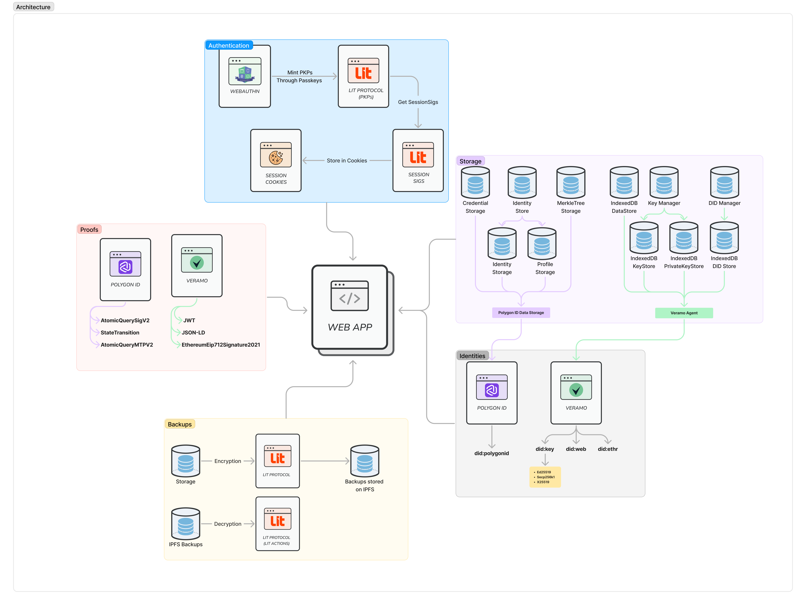
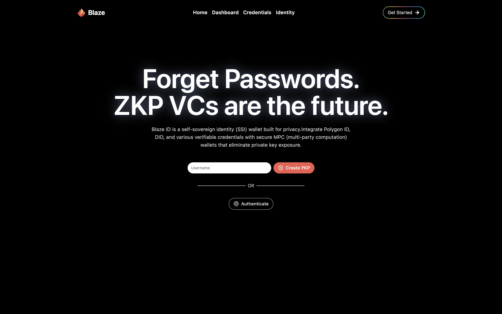
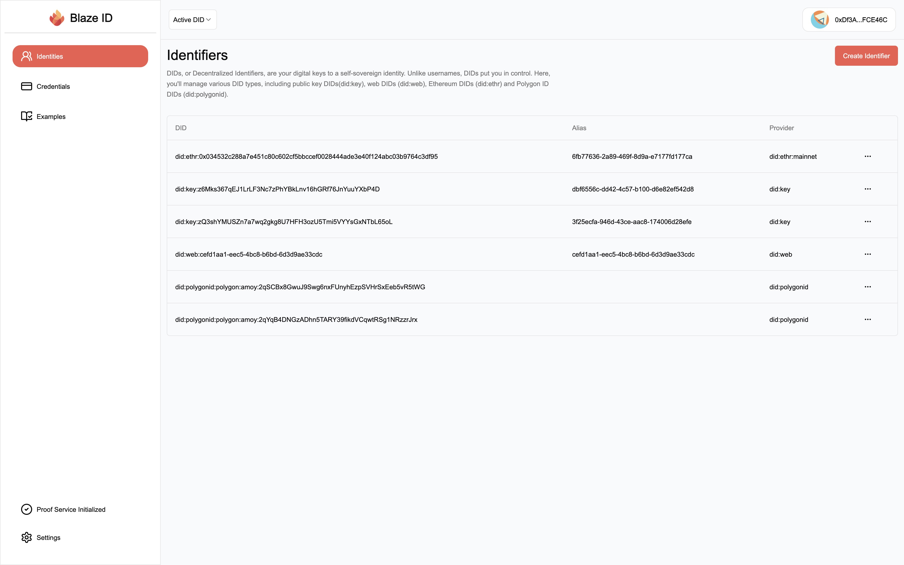
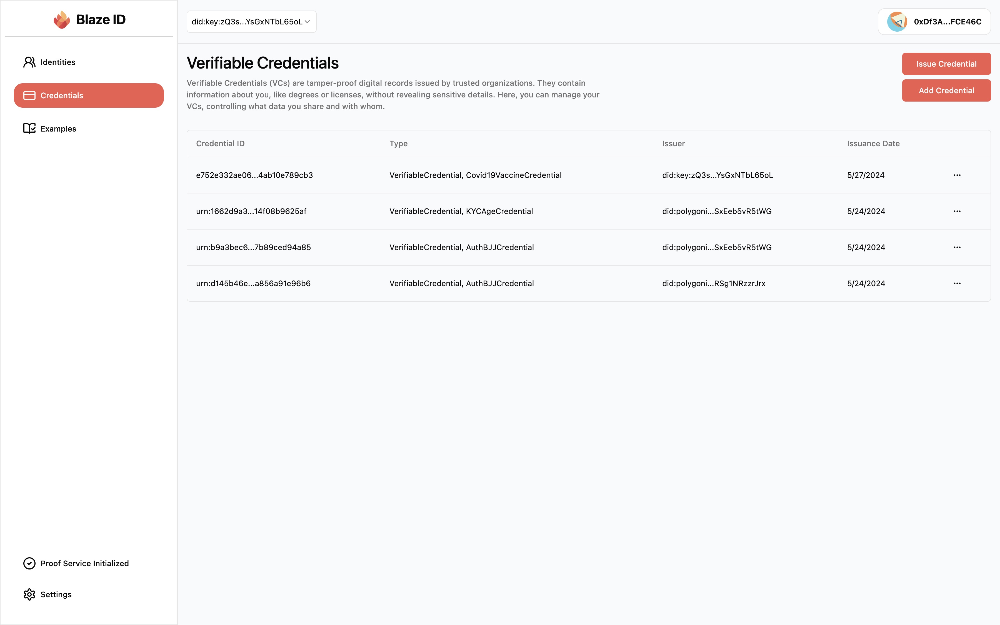
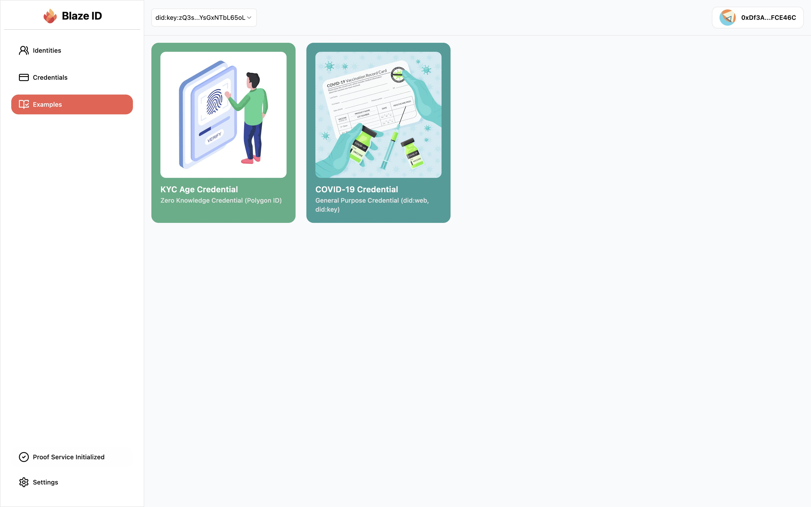
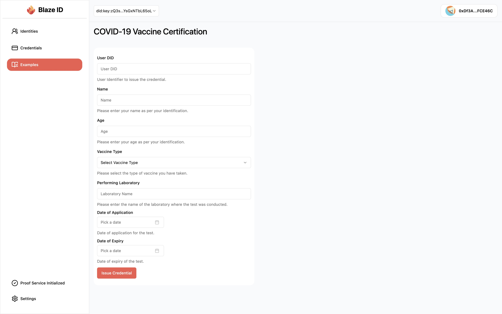
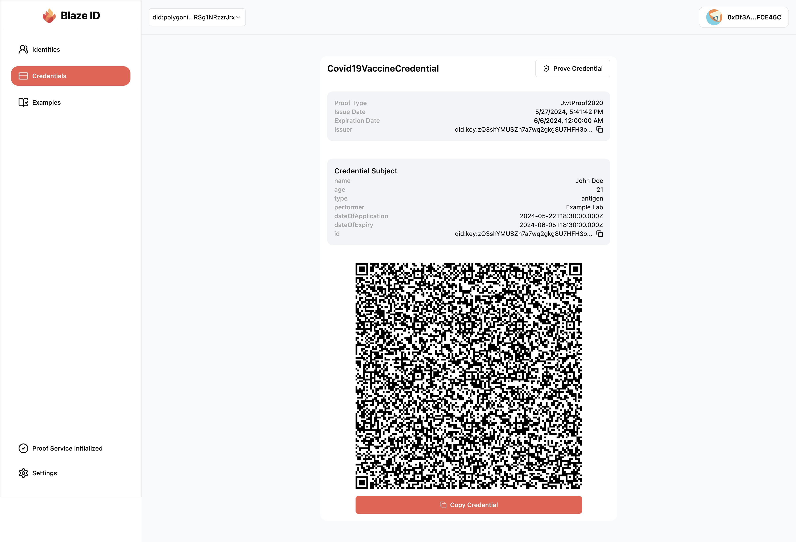
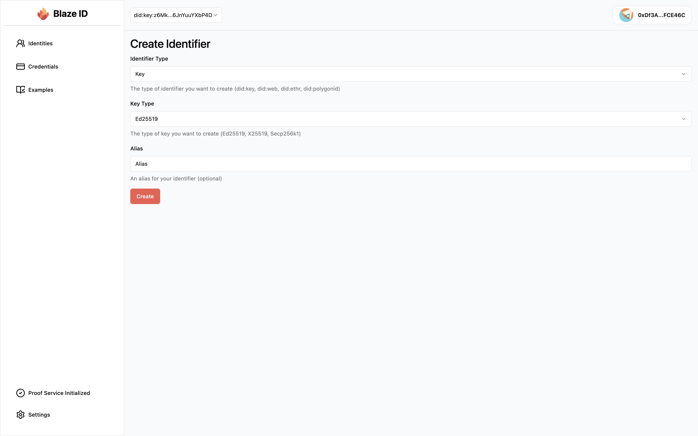
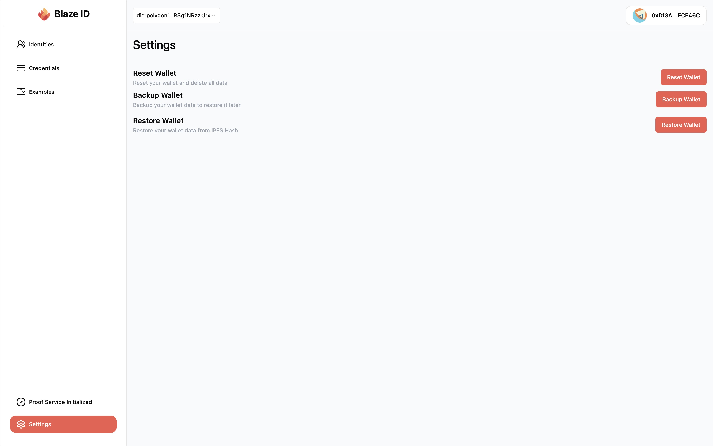

<p align="center">
</p>

Blaze ID is a self-sovereign identity (SSI) wallet solution built on Lit Protocol's programmable key wallets. It supports a variety of Decentralized Identifiers (DIDs) including:

- **`did:key`** - DIDs based on cryptographic keys
- **`did:web`** - DIDs associated with web addresses
- **`did:ethr`** - DIDs linked to Ethereum addresses
- **`did:polygonid`** - Zero-knowledge proof (ZK) based DIDs

Blaze ID enables both ZK-based credential issuance and verification. All data is stored locally first, prioritizing user privacy. Security is ensured through Lit Protocol's Threshold Signature Scheme (TSS) encryption.

## Architecture 🏗️



## How it works 🛠️

### Authentication

Authentication is done through a Lit Protocol's Programmable Key Pair. Users can create a new PKP through WebAuthn Passkeys. Users can use biometric methods such as Face ID or Touch ID to authenticate against their PKPs.

Authentication generates `SessionSigs` which are stored as cookies in the browser. These `SessionSigs` are used to sign transactions and messages on behalf of the user.

### Decentralized Identifiers (DIDs)

Blaze ID supports a variety of DIDs including `did:key`, `did:web`, `did:ethr`, and `did:polygonid`. Users can create new DIDs and associate them with their PKPs.

### Storage

Blaze ID stores all data locally first. This includes DIDs, credentials, and other user data. Data is encrypted using Lit Protocol's Threshold Signature Scheme (TSS) encryption and stored in IndexedDB.

### Credential Issuance

Credentials can be issued via two ways:

1. **ZK-based Issuance**: Credentials are issued using Zero-Knowledge Proofs. This is only available for `did:polygonid` DIDs.
2. **Standard Issuance**: Credentials are issued using W3 Credential standards. This is available for `did:key`, `did:web`, and `did:ethr` DIDs.

There are two examples located in the Examples page:

1. **KYC Credential**: A Zero-Knowledge Proof based KYC credential which proves that the user is over 18 years old.
2. **COVID-19 Vaccination Credential**: A standard W3C credential which proves that the user has been vaccinated.

### Credential Verification

Credentials can be verified via two ways:

1. **ZK-based Verification**: This includes `AtomicQuerySigV2`, `StateTransition`, and `AtomicQueryMTPV2` verification methods loaded as wasm modules.
2. **Standard Verification**: This includes `JWT` verification method.

### Backup and Recovery

Users can backup their data by encrypting it and storing on IPFS using Lit Protocol and recovery by decrypting it using PKPs inside of Lit Actions.

## Demo Video 🎥

## Screenshots 📸

<table>
  <tr>
    <td valign="top" width="50%">
      <br>
      
    </td>
    <td valign="top" width="50%">
      <br>
      
    </td>
  </tr>
</table>

<table>
  <tr>
    <td valign="top" width="50%">
      <br>
            
    </td>
    <td valign="top" width="50%">
      <br>
            
    </td>
  </tr>
</table>

<table>
  <tr>
    <td valign="top" width="50%">
      <br>
            
    </td>
    <td valign="top" width="50%">
      <br>
            
    </td>
  </tr>
</table>

<table>
  <tr>
    <td valign="top" width="50%">
      <br>
            
    </td>
    <td valign="top" width="50%">
      <br>
            
    </td>
  </tr>
</table>

## 🧑🏼‍💻 Tech Stack

- **Frontend**: Next.js, Tailwind CSS, shadcn
- **Integration**: `Lit Protocol`, `@0xpolygonid`, `@simplewebauthn` and `@veramo/core`

## Get Started 🚀

The following repository is a turborepo and divided into the following:

- **apps/www** - The web application built using Next.js.

First install the dependencies by running the following:

```
pnpm install
```

Then fill in the Environment variables in `apps/www/.env.local`

```env
IRON_SESSION_PASSWORD="secure_password_for_sessions"
NEXT_PUBLIC_WALLETCONNECT_ID="walletconnect_project_ir"
CAPACITY_CREDITS_PK="wallet_private_key_to_delegate_capacity_credits"
ALCHEMY_RPC_URL="alchemy_eth_mainnet_rpc_url"
TW_SECRET_KEY="your_thirdweb_secret_key_for_ipfs_uploads"
```

Finally, run the following command to start the application:

```
pnpm dev
```
